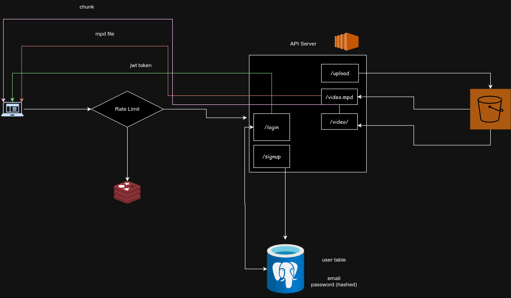

# Video Streaming service using golang
## Dynamic Water-marking 
## MPEG-DASH protocol

### HLD



### Backend (REST endpoint)
there are total 5 endpoints. 2 are unprotected i.e no authenticatin is need to access that. and 
3 are protected i.e you authenticated user to use.
All are written in `golang`
* `/signup` and `/login` are unprotected route. 
* `/upload`, `/video.mpd` and `/video/` are protected route

`Rate limit` is implemented as middleware with redis as counter storage

### Frontend
Frontend is written is `html`, `css` and `JavaScript`.

### Pre-requisite
#### Infra
1. EC2 ( must be medium or above tier) 
2. security group allowing ports
   * port `9090` for golang server
   * port `8888` for pgadmin(optional)
3. S3 bucket
4. IAM Role to access S3 bucket from EC2
5. Access Key and Secret Access Key

#### package
1. ffmpeg
2. unzip
3. go 1.22 ( must be greater or equal to 1.22)
4. aws cli
5. docker and docker compose


### Running the project
After installing the all package listed above clone the the repo
and run 
```bash
cd backend
```

then update the `.env`
```shell
bucket=<s3 bucket name>
folder=uploads
injectString=<BaseURL>http://<public ip of EC2 instance>:9090/video/</BaseURL>
```
after updating the `.env` file, run
```shell
docker compose up -d
go mod tidy
go run .
```
`docker compose` will initialize the `postgres`, `pg-admin` and `redis`

now our server will be listening in port 9090

In the `frontend` folder, we need to update the url of ec2 instance in `fetch` call in `index_aws.html`
After updating the `index_aws.html`, we can run it using `live server` extension in vscode in our local machine

1. It will show the sign up page. please provide the name email and password
2. After that we can sign in using our email and password
3. we need to scroll down to bottom of the page and click `Admin`
4. then we need to upload the video
5. After uploading it will take some times and show success message
6. After that we need to wait to finish `ffmpeg` process. we can check the log in our backend server
7. After finishing the `ffmpeg` operation, we can click `Back to Main` and refresh the page and we can see our video
with water mark `Mehedi`


### Test Rate limit
To test the rate limit, There is `rate_limit_test.go` file in `middlewares` folder. From the root of the project run
```shell
go test ./middlewares
```


